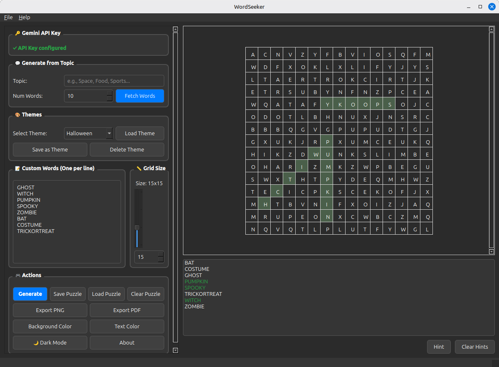

# Word Search Creator

A modern, feature-rich word search puzzle generator and solver built with PySide6 (Qt6). Create custom word search puzzles with AI-powered word generation, multiple themes, dark mode support, and export capabilities.



## Features

### 🎨 Puzzle Generation
- **Custom Word Lists**: Enter your own words manually
- **AI-Powered Generation**: Use Google Gemini API to generate themed word lists automatically
- **Pre-built Themes**: Halloween, Christmas, Faith, Motorsports, and more
- **Flexible Grid Sizes**: Create puzzles from 10x10 to 25x25
- **Smart Algorithm**: Efficient word placement in 8 directions (horizontal, vertical, diagonal)

### 🎯 Interactive Solving
- **Mouse Drag Selection**: Click and drag to select words in any direction
- **Hint System**: Get hints showing the first letter of selected words
- **Progress Tracking**: Visual feedback for found words with highlighted backgrounds
- **Word Lists**: Organized display with up to 10 words per column

### 🌓 Customization
- **Dark Mode**: Eye-friendly dark theme with persistent settings
- **Custom Colors**: Choose your own background and text colors
- **Theme Management**: Save and load custom word themes
- **Persistent Preferences**: Your settings are remembered between sessions

### 💾 Import/Export
- **Save Puzzles**: Save your puzzles as JSON files for later use
- **Load Puzzles**: Resume working on previously saved puzzles
- **PNG Export**: Export high-quality images (50px cells)
- **PDF Export**: Create printable PDF documents with word lists
- **Organized Storage**: Automatic file organization in `saved/` and `exported/` folders

### 🤖 AI Integration
- **Google Gemini API**: Generate contextual word lists from any topic
- **Intelligent Validation**: Automatic word filtering and validation
- **Adjustable Word Count**: Request 4-15 words per topic
- **Multiple Model Support**: Automatic fallback between Gemini models

## Installation

### Prerequisites
- Python 3.12 or higher
- Virtual environment (recommended)

### Setup

1. **Clone the repository**
```bash
git clone https://github.com/QuantumPixelator/Crossword-Creator.git
cd "Crossword Creator"
```

2. **Create and activate virtual environment**
```bash
python3 -m venv venv
source venv/bin/activate  # On Linux/Mac
# or
venv\Scripts\activate     # On Windows
```

3. **Install dependencies**
```bash
pip install -r requirements.txt
```

Or install manually:
```bash
pip install PySide6 pillow reportlab google-generativeai
```

4. **Run the application**
```bash
python main.py
```

## Configuration

### Google Gemini API Key (Optional)

To use AI-powered word generation:

1. Get a free API key from [Google AI Studio](https://makersuite.google.com/app/apikey)
2. In the application, enter your API key in the "🔑 Gemini API Key" section
3. Click "Save Key" to store it securely in `config.json`

Alternatively, set an environment variable:
```bash
export GEMINI_API_KEY="your-api-key-here"
```

## Usage

### Creating a Puzzle

#### Method 1: Manual Entry
1. Enter words in the "Custom Words" text area (one per line)
2. Adjust grid size using the slider or spin box (10-25)
3. Click "Generate" to create the puzzle

#### Method 2: Theme Selection
1. Select a theme from the dropdown (Halloween, Christmas, etc.)
2. Click "Load Theme" to populate words
3. Click "Generate" to create the puzzle

#### Method 3: AI Generation
1. Enter your API key in the settings
2. Type a topic (e.g., "Space", "Animals", "Sports")
3. Set the number of words (4-15)
4. Click "Fetch Words" to generate words using AI
5. Click "Generate" to create the puzzle

### Solving a Puzzle

1. Click and drag across letters to select a word
2. Selection works in all 8 directions
3. Found words are highlighted with a green background
4. Click a word in the list to select it
5. Click "Hint" to reveal the first letter of the selected word
6. Click "Clear Hints" to remove hint highlighting

### Saving and Loading

- **Save Puzzle**: File → Save Puzzle (or Ctrl+S)
- **Load Puzzle**: File → Load Puzzle (or Ctrl+O)
- **Export PNG**: File → Export PNG
- **Export PDF**: File → Export PDF

All files are automatically organized:
- Puzzles: `saved/` folder (*.json)
- Exports: `exported/` folder (*.png, *.pdf)

### Theme Management

1. Load or create a custom word list
2. Click "Save as Theme" and enter a name
3. Your theme appears in the dropdown
4. Click "Delete Theme" to remove custom themes

## Project Structure

```
Crossword Creator/
├── main.py              # Main application and UI
├── constants.py         # Configuration and constants
├── utils.py            # Helper functions and API integration
├── puzzle_engine.py    # Word search generation algorithm
├── widgets.py          # Custom PuzzleGrid widget
├── export.py           # PNG and PDF export functions
├── config.json         # User settings (API key, dark mode)
├── themes.json         # Custom word themes
├── saved/              # Saved puzzle files
├── exported/           # Exported PNG/PDF files
├── requirements.txt    # Python dependencies
├── README.md           # This file
└── LICENSE             # MIT License
```

## Keyboard Shortcuts

- **Ctrl+S**: Save Puzzle
- **Ctrl+O**: Load Puzzle
- **Ctrl+Q**: Quit Application

## Requirements

- **PySide6**: Qt6 framework for GUI
- **Pillow**: Image processing for PNG export
- **reportlab**: PDF generation
- **google-generativeai**: Google Gemini API integration (optional)

## Features in Detail

### Smart Word Placement
- Longest words placed first for optimal fit
- 8-directional placement (horizontal, vertical, 4 diagonals)
- Conflict detection and retry logic
- Words can share letters at intersections
- Random letter fill for empty cells

### Word Validation
- Automatic uppercase conversion
- Length validation (2-15 letters)
- Alphabetic character check
- Duplicate removal
- Maximum word count enforcement

### Visual Feedback
- Found words: Pale green background (#C8E6C9)
- Hints: Gold background (#FFD700)
- Drag selection: Light blue line
- Dark mode: Adjusted colors for eye comfort

## Troubleshooting

### API Key Issues
- Ensure your API key is valid and has access to Gemini models
- Check your internet connection
- Verify you haven't exceeded API quota limits

### Import Errors
- Make sure you're running from the virtual environment
- Reinstall dependencies: `pip install -r requirements.txt`

### Dark Mode Not Saving
- Check that `config.json` is writable
- Ensure the application has permission to create files

### Export Failures
- Verify the `exported/` folder is writable
- Check that Pillow and reportlab are installed
- File extensions are added automatically if missing

## Contributing

Contributions are welcome! Please feel free to submit a Pull Request.

1. Fork the repository
2. Create your feature branch (`git checkout -b feature/AmazingFeature`)
3. Commit your changes (`git commit -m 'Add some AmazingFeature'`)
4. Push to the branch (`git push origin feature/AmazingFeature`)
5. Open a Pull Request

## License

This project is licensed under the MIT License - see below for details:

```
MIT License

Copyright (c) 2025 QuantumPixelator

Permission is hereby granted, free of charge, to any person obtaining a copy
of this software and associated documentation files (the "Software"), to deal
in the Software without restriction, including without limitation the rights
to use, copy, modify, merge, publish, distribute, sublicense, and/or sell
copies of the Software, and to permit persons to whom the Software is
furnished to do so, subject to the following conditions:

The above copyright notice and this permission notice shall be included in all
copies or substantial portions of the Software.

THE SOFTWARE IS PROVIDED "AS IS", WITHOUT WARRANTY OF ANY KIND, EXPRESS OR
IMPLIED, INCLUDING BUT NOT LIMITED TO THE WARRANTIES OF MERCHANTABILITY,
FITNESS FOR A PARTICULAR PURPOSE AND NONINFRINGEMENT. IN NO EVENT SHALL THE
AUTHORS OR COPYRIGHT HOLDERS BE LIABLE FOR ANY CLAIM, DAMAGES OR OTHER
LIABILITY, WHETHER IN AN ACTION OF CONTRACT, TORT OR OTHERWISE, ARISING FROM,
OUT OF OR IN CONNECTION WITH THE SOFTWARE OR THE USE OR OTHER DEALINGS IN THE
SOFTWARE.
```

## Acknowledgments

- Built with [PySide6](https://doc.qt.io/qtforpython/) (Qt for Python)
- AI word generation powered by [Google Gemini](https://ai.google.dev/)
- PDF export using [ReportLab](https://www.reportlab.com/)
- Image processing with [Pillow](https://python-pillow.org/)

## Author

**QuantumPixelator**
- GitHub: [@QuantumPixelator](https://github.com/QuantumPixelator)
- Repository: [Crossword-Creator](https://github.com/QuantumPixelator/Crossword-Creator)

## Version History

### v1.0.0 (2025-10-30)
- Initial release
- Complete word search generation and solving
- AI-powered word generation
- Dark mode support
- PNG/PDF export
- Theme management
- Persistent settings

---

**Happy Puzzle Creating! 🎯✨**
